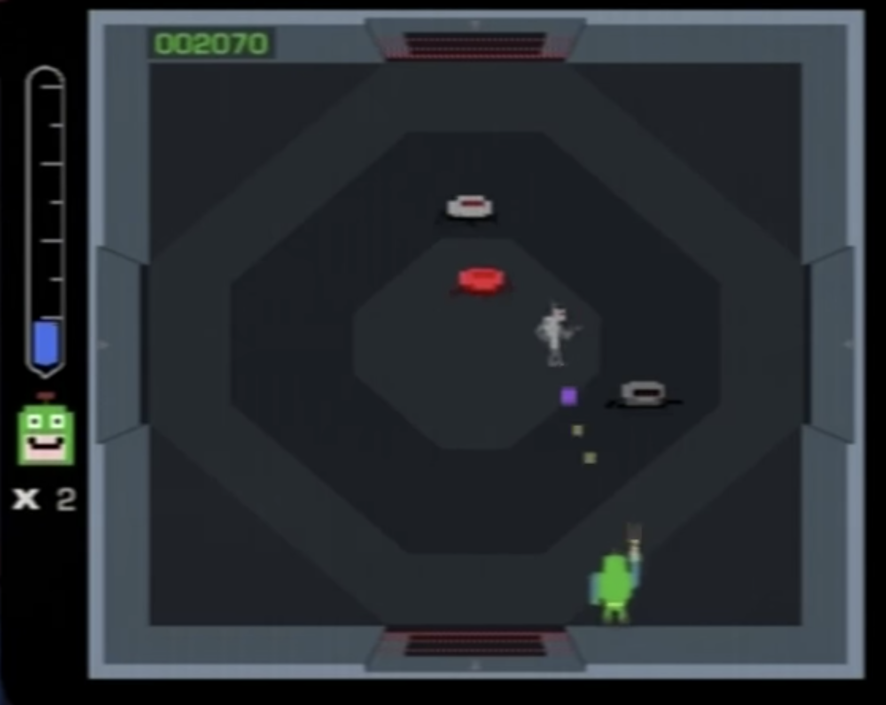

APH shooter
======================
A game made as a MI-APH Semestral work.

How to setup
--------------
#. Have npm installed
#. Run :code:`npm install` to install all needed dependencies.
#. Run :code:`npm run` to start the dev-server.
#. Navigate to :code:`localhost:1234/index.html` to play the game.

About the game
-----------------------
It is a shooter. The player's goal is to survive as long as possible and get highest score by shooting enemies.

The map is of fixed size. Players can't go outside of bounds of the map. Enemies spawn in waves.

	*Figure: What gameplay looks like.*

Controls
______________

:Movement: W/A/S/D
:Shooting: Left mouse button
:Player rotation: Mouse