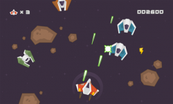

APH space shooter
======================
A game made as a MI-APH Semestral work.

How to setup
--------------
#. Have npm installed
#. Run :code:`npm install` to install all needed dependencies.
#. Run :code:`npm run` to start the dev-server.
#. Navigate to :code:`localhost:1234/index.html` to play the game.

About the game
-----------------------
It is a space shooter. The player's goal is to survive as long as possible and get highest score by shooting enemy ships.

The map is randomly generated at the start of the game and its size is fixed. Players can't go outside of bounds of the map.

	*Figure: What gameplay looks like.*

Controls
______________

:movement: W/A/S/D
:shooting: J